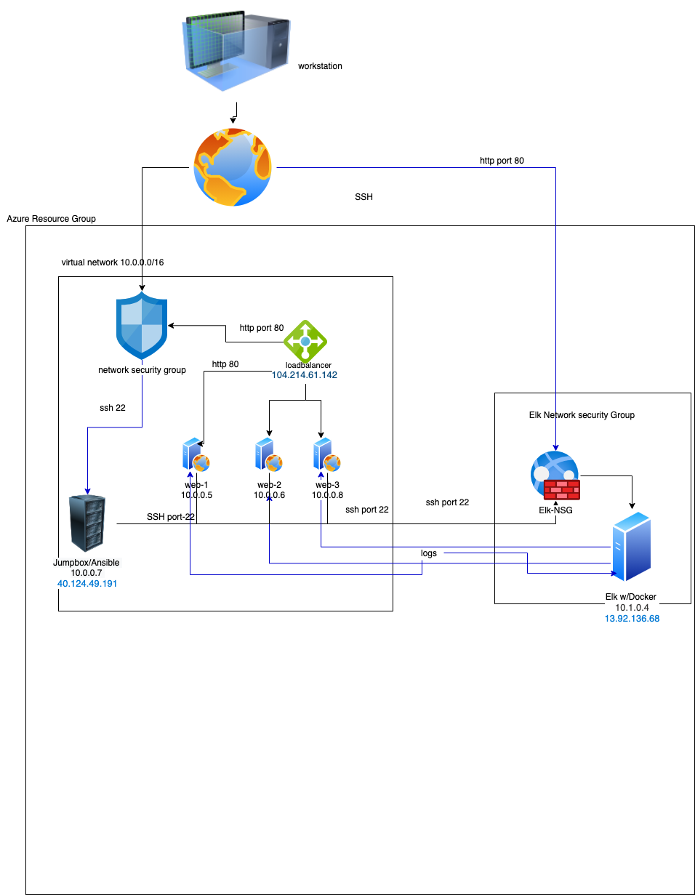

## Automated ELK Stack Deployment

The files in this repository were used to configure the network depicted below.



These files have been tested and used to generate a live ELK deployment on Azure. They can be used to either recreate the entire deployment pictured above. Alternatively, select portions of the _____ file may be used to install only certain pieces of it, such as Filebeat.

```
---
- name: Configure Elk VM with Docker
  hosts: elk
  remote_user: RedAdmin
  become: true
  tasks:
    # Use apt module
    - name: Install docker.io
      apt:
        update_cache: yes
        name: docker.io
        state: present

      # Use apt module
    - name: Install pip3
      apt:
        force_apt_get: yes
        name: python3-pip
        state: present

      # Use pip module
    - name: Install Docker python module
      pip:
        name: docker
        state: present

      # Use sysctl module
    - name: Use more memory
      sysctl:
        name: vm.max_map_count
        value: "262144"
        state: present
        reload: yes

      # Use docker_container module
    - name: download and launch a docker elk container
      docker_container:
        name: elk
        image: sebp/elk:761
        state: started
        restart_policy: always
        published_ports:
          - 5601:5601
          - 9200:9200
          - 5044:5044

      # Use systemd module
    - name: Enable service docker on boot
      systemd:
        name: docker
        enabled: yes
```


This document contains the following details:
- Description of the Topologu
- Access Policies
- ELK Configuration
  - Beats in Use
  - Machines Being Monitored
- How to Use the Ansible Build


### Description of the Topology

The main purpose of this network is to expose a load-balanced and monitored instance of DVWA, the D*mn Vulnerable Web Application.

Load balancing ensures that the application will be highly available, in addition to restricting inbound traffic to the network.


Integrating an ELK server allows users to easily monitor the vulnerable VMs for changes to the configuration and system logs.
- _TODO: What does Filebeat watch for?_ watches for file access and modifications
- _TODO: What does Metricbeat record?_ records all virtual machine performance and logs activity.

The configuration details of each machine may be found below.
_Note: Use the [Markdown Table Generator](http://www.tablesgenerator.com/markdown_tables) to add/remove values from the table_.

| Name     | Function | IP Address | Operating System |
|----------|----------|------------|------------------|
| Jump Box | Gateway  | 10.0.0.7 40.124.49.191| Linux            |
| web-1    |web server | 10.0.0.5  | Linux |
| web-2    | web server| 10.0.0.6  | Linux |
| web-3    |web server |  10.0.0.8 | Linux |
| ELk-Vm | Read Logs | 13.92.136.68 10.1.0.4| Linux

### Access Policies

The machines on the internal network are not exposed to the public Internet.

Only the Jumpbox Provisioner machine can accept connections from the Internet. Access to this machine is only allowed from the following IP addresses:
- my public ip address 71.41.180.18

Machines within the network can only be accessed by Jumpbox.
-

A summary of the access policies in place can be found in the table below.

| Name     | Publicly Accessible | Allowed IP Addresses |
|----------|---------------------|----------------------|
| Jump Box | Yes/No              | 10.0.0.1 10.0.0.2    |
|   ELK    |   yes               |  71.41.180.18        |
|          |                     |                      |

### Elk Configuration

Ansible was used to automate configuration of the ELK machine. No configuration was performed manually, which is advantageous because... automation of containers make it easily scalable
-

The playbook implements the following tasks:
- _TODO: In 3-5 bullets, explain the steps of the ELK installation play. E.g., install Docker; download image; etc._
- ...Install docker.io
Install pip3
Install Docker python module
 Use more memory
 download and launch a docker elk container
- ...

The following screenshot displays the result of running `docker ps` after successfully configuring the ELK instance.


### Target Machines & Beats
This ELK server is configured to monitor the following machines:
- web1 10.0.0.5, web2 10.0.0.6, web3 10.0.0.8

We have installed the following Beats on these machines:
- web1, web2, web3

These Beats allow us to collect the following information from each machine:
- _TODO: In 1-2 sentences, explain what kind of data each beat collects, and provide 1 example of what you expect to see. E.g., `winlog` collects Windows logs, which we use to track user logon events, etc._
Filebeat allows us to grab data about files requested and http responses
Metricbeat allows us to take data about CPU usage and geo stats.

### Using the Playbook
In order to use the playbook, you will need to have an Ansible control node already configured. Assuming you have such a control node provisioned:

SSH into the control node and follow the steps below:
- Copy the playbook file to ansible.
- Update the host file to include... webservers and elk ip's.
- Run the playbook, and navigate to elk vm to check that the installation worked as expected.

_TODO: Answer the following questions to fill in the blanks:_
- _Which file is the playbook? Where do you copy it?_
install_elkvm.yml, filebeat-playbook.yml, metricbest-playbook.yml, pentest.yml. copy it to the ansible container directory.
- _Which file do you update to make Ansible run the playbook on a specific machine? How do I specify which machine to install the ELK server on versus which to install Filebeat on?_
hosts file. Add/change hosts (webservers, elk).
- _Which URL do you navigate to in order to check that the ELK server is running?
http://13.92.136.68:5601/app/kibana#/home
_As a **Bonus**, provide the specific commands the user will need to run to download the playbook, update the files, etc._
to download run command $ansible-playbook filebeat.yml
